# Applications

The programming model of Linera is designed so that developers can take
advantage of microchains to scale their applications.

Linera uses the [WebAssembly (Wasm)](https://webassembly.org) Virtual Machine to
execute user applications. Currently, the [Linera SDK](../backend.md) is focused
on the [Rust](https://www.rust-lang.org/) programming language for the backend
and [TypeScript](https://www.typescriptlang.org/) for the frontend.

Linera applications are structured using the familiar notion of **Rust crate**:
the external interfaces of an application (including instantiation parameters,
operations and messages) generally go into the library part of its crate, while
the core of each application is compiled into binary files for the Wasm
architecture.

## The Application deployment lifecycle

Linera Applications are designed to be powerful yet re-usable. For this reason
there is a distinction between the bytecode and an application instance on the
network.

Applications undergo a lifecycle transition aimed at making development easy and
flexible:

1. The bytecode is built from a Rust project with the `linera-sdk` dependency.
2. The bytecode is published to the network on a microchain, and assigned an
   identifier.
3. A user can create a new application instance, by providing the bytecode
   identifier and instantiation arguments. This process returns an application
   identifier which can be used to reference and interact with the application.
4. The same bytecode identifier can be used as many times needed by as many
   users needed to create distinct applications.

Importantly, the application deployment lifecycle is abstracted from the user,
and an application can be published with a single command:

```bash
linera publish-and-create <contract-path> <service-path> <init-args>
```

This will publish the bytecode as well as instantiate the application for you.

## Anatomy of an application

An **application** is broken into two major components, the _contract_ and the
_service_.

The **contract** is gas-metered, and is the part of the application which
executes operations and messages, make cross-application calls and modifies the
application's state. The details are covered in more depth in the
[application backend guide](../backend.md).

The **service** is non-metered and read-only. It is used primarily to query the
state of an application and populate the presentation layer (think front-end)
with the data required for a user interface.

## Operations and messages

> For this section we'll be using a simplified version of the example
> application called "fungible" where users can send tokens to each other.

At the system-level, interacting with an application can be done via operations
and messages.

**Operations** are defined by an application developer and each application can
have a completely different set of operations. Chain owners then actively create
operations and put them in their block proposals to interact with an
application. Other applications may also call the application by providing an
operation for it to execute, this is called a cross-application call and always
happens within the same chain. Operations for cross-application calls may return
a response value back to the caller.

Taking the "fungible token" application as an example, an operation for a user
to transfer funds to another user would look like this:

```rust
# extern crate serde;
# extern crate linera_sdk;
# use serde::{Deserialize, Serialize};
# use linera_sdk::linera_base_types::*;
#[derive(Debug, Deserialize, Serialize)]
pub enum Operation {
    /// A transfer from a (locally owned) account to a (possibly remote) account.
    Transfer {
        owner: AccountOwner,
        amount: Amount,
        target_account: Account,
    },
    // Meant to be extended here
}
```

**Messages** result from the execution of operations or other messages. Messages
can be sent from one chain to another, always within the same application. Block
proposers also actively include messages in their block proposal, but unlike
with operations, they are only allowed to include them in the right order
(possibly skipping some), and only if they were actually created by another
chain (or by a previous block of the same chain). Messages that originate from
the same transaction are included as a single transaction in the receiving
block.

In our "fungible token" application, a message to credit an account would look
like this:

```rust
# extern crate serde;
# extern crate linera_sdk;
# use serde::{Deserialize, Serialize};
# use linera_sdk::linera_base_types::*;
#[derive(Debug, Deserialize, Serialize)]
pub enum Message {
    Credit { owner: AccountOwner, amount: Amount },
    // Meant to be extended here
}
```

Messages can be marked as **tracked** by their sender. When a tracked message is
rejected, the message is marked as **bouncing** and sent back to the sender
chain. This is useful to avoid dropping assets in case the receiver is not able
or wanting to accept them.

### Composing applications

Within a chain, Linera applications call each other synchronously. The
transactions of a block initiates the first call to an application. The
atomicity of **message bundles** ensures that the messages created by a
transaction are either all received or all rejected by the receiver chain.

The following example shows a common design pattern where a high-level
application (here, a crowd-funding app) calls into another application (here an
ERC-20-like application managing a fungible token), resulting in a bundle of two
messages.

```mermaid
 flowchart LR
    subgraph user_chain["User chain"]
      block("operation in block") -- calls (with signer) (1) --> app11
      subgraph exec_user["Execution state"]
        app11["crowdfunding app"] -- calls (with signer) (2) --> app21["fungible token app"]
      end
    end

    subgraph app_chain["Crowdfunding app chain"]
      subgraph exec_app["Execution state"]
        app12["crowdfunding app"] -- calls (7) --> app22["fungible token app"]
      end
      bundle("Incoming message bundle<br>[assets, pledge]")
    end

    app11 -- send pledge (4) --> bundle
    app21 -- send assets (3) --> bundle
    bundle -- receive pledge (6) --> app12
    bundle -- receive assets (5) --> app22

    %% Styling
    style user_chain fill:#1A4456,stroke:#70D4D3,stroke-width:2px,stroke-dasharray:3 3,rx:10,ry:10
    style app_chain fill:#1A4456,stroke:#70D4D3,stroke-width:2px,stroke-dasharray:3 3,rx:10,ry:10
    style exec_user fill:#0e2630,stroke:#A0E3E2,stroke-width:1px,stroke-dasharray:2 2,rx:8,ry:8
    style exec_app fill:#0e2630,stroke:#A0E3E2,stroke-width:1px,stroke-dasharray:2 2,rx:8,ry:8

    style app11 fill:#4A7B75,stroke:#70D4D3,stroke-width:2px
    style app12 fill:#4A7B75,stroke:#70D4D3,stroke-width:2px
    style app21 fill:#3A6B7A,stroke:#A0E3E2,stroke-width:2px
    style app22 fill:#3A6B7A,stroke:#A0E3E2,stroke-width:2px
    style bundle fill:#5A8269,stroke:#D2E8C8,stroke-width:2px

```



When a user proposes a block in their user chain, operations inherit the
authentication of the user (aka **signer** or **origin**) that signed the block.
Calls may optionally forward this authentication, for instance to allow the
transfer of assets.

### Authentication

Operations in a block are always authenticated and messages may be
authenticated. The signer of a block becomes the authenticator of all the
operations in that block. As operations are being executed by applications,
messages can be created to be sent to other chains. When they are created, they
can be configured to be authenticated. In that case, the message receives the
same authentication as the operation that created it. If handling an incoming
message creates new messages, those may also be configured to have the same
authentication as the received message.

In other words, the block signer can have its authority propagated across chains
through series of messages. This allows applications to safely store user state
on chains that the user may not have the authority to produce blocks. The
application may also allow only the authorized user to change that state, and
not even the chain owner is able to override that.

The figure below shows four chains (A, B, C, D) and some blocks produced in
them. In this example, each chain is owned by a single owner (aka. address).
Owners are in charge of producing blocks and sign new blocks using their signing
keys. Some blocks show the operations and incoming messages they accept, where
the authentication is shown inside parenthesis. All operations produced are
authenticated by the block proposer, and if these are all single user chains,
the proposer is always the chain owner. Messages that have authentication use
the one from the operation or message that created it.

One example in the figure is that chain A produced a block with Operation 1,
which is authenticated by the owner of chain A (written `(a)`). That operation
sent a message to chain B, and assuming the message was sent with the
authentication forwarding enabled, it is received and executed in chain B with
the authentication of `(a)`. Another example is that chain D produced a block
with Operation 2, which is authenticated by the owner of chain D (written
`(d)`). That operation sent a message to chain C, which is executed with
authentication of `(d)` like the example before. Handling that message in chain
C produced a new message, which was sent to chain B. That message, when received
by chain B is executed with the authentication of `(d)`.

```ignore
                            ┌───┐     ┌─────────────────┐     ┌───┐
       Chain A owned by (a) │   ├────►│ Operation 1 (a) ├────►│   │
                            └───┘     └────────┬────────┘     └───┘
                                               │
                                               └────────────┐
                                                            ▼
                                                ┌──────────────────────────┐
                            ┌───┐     ┌───┐     │ Message from chain A (a) │
       Chain B owned by (b) │   ├────►│   ├────►│ Message from chain C (d) |
                            └───┘     └───┘     │ Operation 3 (b)          │
                                                └──────────────────────────┘
                                                            ▲
                                                   ┌────────┘
                                                   │
                            ┌───┐     ┌──────────────────────────┐     ┌───┐
       Chain C owned by (c) │   ├────►│ Message from chain D (d) ├────►│   │
                            └───┘     └──────────────────────────┘     └───┘
                                                 ▲
                                     ┌───────────┘
                                     │
                            ┌─────────────────┐     ┌───┐     ┌───┐
       Chain D owned by (d) │ Operation 2 (d) ├────►│   ├────►│   │
                            └─────────────────┘     └───┘     └───┘
```

An example where this is used is in the Fungible application, where a `Claim`
operation allows retrieving money from a chain the user does not control (but
the user still trusts will produce a block receiving their message). Without the
`Claim` operation, users would only be able to store their tokens on their own
chains, and multi-owner and public chains would have their tokens shared between
anyone able to produce a block.

With the `Claim` operation, users can store their tokens on another chain where
they're able to produce blocks or where they trust the owner will produce blocks
receiving their messages. Only they are able to move their tokens, even on
chains where ownership is shared or where they are not able to produce blocks.
