# Common Design Patterns

We now explore some common design patterns to take advantage of microchains.

## Applications with only user chains

Some applications such as payments only require user chains, hence are fully
horizontally scalable:

```mermaid
flowchart LR
    user1(["user 1"]) -- initiates transfer --> chain1

    subgraph validators_only_users["Validators"]
      chain1["user chain 1"] -- "sends assets" --> chain2["user chain 2"]
    end

    chain2 -- notifies --> user2(["user 2"])

    %% Styling
    style validators_only_users fill:#1A4456,stroke:#70D4D3,stroke-width:2px,stroke-dasharray:3 3,rx:10,ry:10
    style user1 fill:#8B7355,stroke:#EDE4D2,stroke-width:2px
    style user2 fill:#8B7355,stroke:#EDE4D2,stroke-width:2px
    style chain1 fill:#3A6B7A,stroke:#A0E3E2,stroke-width:2px
    style chain2 fill:#3A6B7A,stroke:#A0E3E2,stroke-width:2px

```

**Example:** the
[fungible demo application](https://github.com/linera-io/linera-protocol/tree/main/examples/fungible)
of the Linera codebase.

## Client/server applications

Pre-existing applications (e.g. written in Solidity) generally run on a single
chain of blocks for all users. Those can be embedded in an app chain to act as a
service.

```mermaid
flowchart LR
    user1(["user 1"]) -- initiates request --> chain1
    user1 ~~~ chain1
    provider(["block producer"]) -- initiate response(s) --> chain3
    chain1 -- notifies --> user1
    chain3 -- notifies --> provider

    subgraph validators_cs["Validators"]
      chain1["user chain 1"] -- "sends request" --> chain3
      chain1 ~~~ chain3
      chain2["user chain 2"] --> chain3
      chain3["app chain"] -- "sends response" --> chain1
    end

    %% Styling
    style validators_cs fill:#1A4456,stroke:#70D4D3,stroke-width:2px,stroke-dasharray:3 3,rx:10,ry:10
    style user1 fill:#8B7355,stroke:#EDE4D2,stroke-width:2px
    style provider fill:#A0736B,stroke:#D2E8C8,stroke-width:2px
    style chain1 fill:#3A6B7A,stroke:#A0E3E2,stroke-width:2px
    style chain2 fill:#3A6B7A,stroke:#A0E3E2,stroke-width:2px
    style chain3 fill:#4A7B75,stroke:#70D4D3,stroke-width:2px

```

> Depending on the nature of the application, the blocks produced in the app
> chain may be restricted to only contain messages (no operations). This is to
> ensure that block producers have no influence on a chain, other than selecting
> incoming messages.

**Example:** the
[crowd-funding demo application](https://github.com/linera-io/linera-protocol/tree/main/examples/crowd-funding)
of the Linera codebase.

## Using personal chains to scale applications

User chains are useful to store the assets of their users and initiate requests
to app chains. Yet, oftentimes, they can also help applications scale
horizontally by taking work out of the app chains.

```mermaid
flowchart LR
    user1(["user 1"]) -- submits ZK proof --> chain1

    subgraph microchains_scale["Microchains"]
      chain1["user chain 1"]
      chain0["airdrop chain"]
      chain1 -- "sends trusted message《ZK proof is valid》" --> chain0
      chain1 ~~~ chain0
      chain0 -- "sends tokens" --> chain1
      chain2["user chain 2"] --> chain0
    end

    %% Styling
    style microchains_scale fill:#1A4456,stroke:#70D4D3,stroke-width:2px,stroke-dasharray:3 3,rx:10,ry:10
    style user1 fill:#8B7355,stroke:#EDE4D2,stroke-width:2px
    style chain1 fill:#3A6B7A,stroke:#A0E3E2,stroke-width:2px
    style chain2 fill:#3A6B7A,stroke:#A0E3E2,stroke-width:2px
    style chain0 fill:#4A7B75,stroke:#70D4D3,stroke-width:2px

```

One of the benefits of personal chains is to enable transactions that would be
too slow or not deterministic enough for traditional blockchains, including:

- Validating ZK proofs,
- Sending web queries to external oracle services (e.g. AI inference) and other
  API providers,
- Downloading data blobs from external data availability (”DA”) layers and
  computing app-specific invariants.

**Example (unfinished):** the
[airdrop demo application](https://github.com/linera-io/airdrop-demo) of the
Linera project.

## Using temporary chains to scale applications

Temporary chains can be created on demand and configured to accept blocks from
specific users.

The following diagram allows a virtually unlimited number of games (e.g. chess
game) to be spawned for a given tournament.

```mermaid
flowchart LR
    subgraph microchains_scale["Microchains"]
      chain1["user chain 1"] <--> chain3
      chain2["user chain 2"] <--> chain3
      chain3["tournament app chain"] -- creates --> chain0["temporary game chain"]
      chain0 -- reports result --> chain3
    end

    user1(["user 1"]) -- request game --> chain1
    user2(["user 2"]) -- request game --> chain2
    user1 -- plays --> chain0
    user2 -- plays --> chain0

    %% Styling
    style microchains_scale fill:#1A4456,stroke:#70D4D3,stroke-width:2px,stroke-dasharray:3 3,rx:10,ry:10
    style user1 fill:#8B7355,stroke:#EDE4D2,stroke-width:2px
    style user2 fill:#8B7355,stroke:#EDE4D2,stroke-width:2px
    style chain1 fill:#3A6B7A,stroke:#A0E3E2,stroke-width:2px
    style chain2 fill:#3A6B7A,stroke:#A0E3E2,stroke-width:2px
    style chain3 fill:#4A7B75,stroke:#70D4D3,stroke-width:2px

```

**Example:** the
[hex-game demo application](https://github.com/linera-io/linera-protocol/tree/main/examples/hex-game)
of the Linera codebase.

## Just-in-time oracles

We have seen that Linera clients are connected and don’t rely on external RPC
providers to read on-chain data from the chain. This ability to receive secure,
censorship-resistant notifications and read data from the network is a game
changer allowing on-chain applications to query certain clients in real time.

For instance, clients may be running an AI oracle off-chain in a trusted
execution environment (TEE), allowing on-chain application to extract important
information form the Internet.

```mermaid
flowchart LR
    subgraph validators_only_users["Validators"]
      chain2 -- oracle response --> chain1
      chain1["app chain"] -- "oracle query" --> chain2["oracle chain"]
    end
    subgraph tee["Oracle TEE"]
      user2(["oracle client"]) <--> ai["AI oracle"]
    end
    chain2 -- notifies --> user2
    user2 -- submit response --> chain2
    ai <--> web((Web))

    %% Styling
    style validators_only_users fill:#1A4456,stroke:#70D4D3,stroke-width:2px,stroke-dasharray:3 3,rx:10,ry:10
    style tee fill:#1A4456,stroke:#A0E3E2,stroke-width:2px,stroke-dasharray:3 3,rx:10,ry:10
    style user2 fill:#8B7355,stroke:#EDE4D2,stroke-width:2px
    style ai fill:#A0736B,stroke:#D2E8C8,stroke-width:2px
    style chain1 fill:#3A6B7A,stroke:#A0E3E2,stroke-width:2px
    style chain2 fill:#3A6B7A,stroke:#A0E3E2,stroke-width:2px

```

