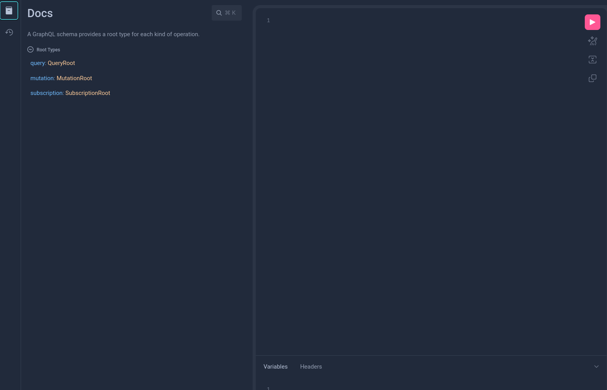

# Node Service

So far we've seen how to use the Linera client treating it as a binary in your
terminal. However, the client also acts as a node which:

1. Executes blocks
2. Exposes a GraphQL API and IDE for dynamically interacting with applications
   and the system
3. Listens for notifications from validators and automatically updates local
   chains.

To interact with the node service, run `linera` in `service` mode:

```bash
linera service
```

This will run the node service on port 8080 by default (this can be overridden
using the `--port` flag).

## A note on GraphQL

Linera uses GraphQL as the query language for interfacing with different parts
of the system. GraphQL enables clients to craft queries such that they receive
exactly what they want and nothing more.

GraphQL is used extensively during application development, especially to query
the state of an application from a front-end for example.

To learn more about GraphQL check out the
[official docs](https://graphql.org/learn/).

## GraphiQL IDE

Conveniently, the node service exposes a GraphQL IDE called GraphiQL. To use
GraphiQL start the node service and navigate to `localhost:8080/`.

Using the schema explorer on the left of the GraphiQL IDE you can dynamically
explore the state of the system and your applications.



## GraphQL system API

The node service also exposes a GraphQL API which corresponds to the set of
system operations. You can explore the full set of operations by clicking on
`MutationRoot`.

## GraphQL application API

To interact with an application, we run the Linera client in service mode. It
exposes a GraphQL API for every application running on any owned chain at
`localhost:8080/chains/<chain-id>/applications/<application-id>`.

Navigating there with your browser will open a GraphiQL interface which enables
you to graphically explore the state of your application.

## Connecting AI agents to Linera applications in MCP

Most AI agents understand the
[Model Context Protocol](https://modelcontextprotocol.io) (MCP for short).

GraphQL service can be turned an MCP server using
[Apollo MCP Server](https://www.apollographql.com/docs/apollo-mcp-server).

More information can be found in the
[`mcp-demo`](https://github.com/linera-io/mcp-demo) repository.
