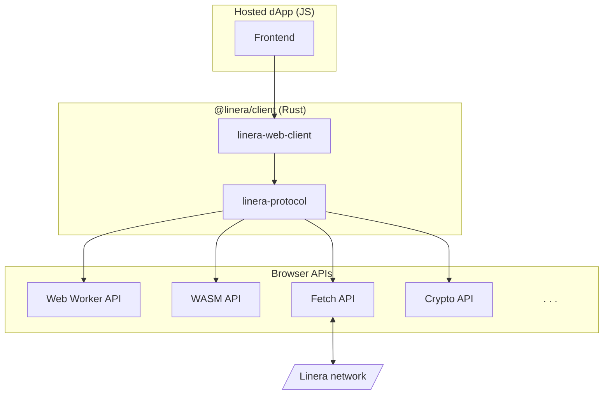

# Frontend Architecture Overview

The Linera client library is written in Rust. To make it available to Web
applications, we first compile it to WebAssembly, then wrap it with some
JavaScript convenience APIs using
[`wasm-bindgen`](https://github.com/rustwasm/wasm-bindgen). This wrapper will
first download the client WebAssembly blob, and then forward calls to it, doing
marshalling as necessary.

In addition, on the Web some system APIs are provided in the browser as
JavaScript APIs, so making system calls for these is replaced by FFI calls to
the equivalent browser APIs. Notably:

- to get the current date/time, we use the JavaScript
  [`Date::now`](https://developer.mozilla.org/en-US/docs/Web/JavaScript/Reference/Global_Objects/Date/now)
  API
- as our source of cryptographic randomness, we use the
  [Web Crypto API](https://www.w3.org/TR/WebCryptoAPI/#Crypto-method-getRandomValues)
- [Tokio](https://tokio.rs/) is replaced by JavaScript promises on the browser
  event loop
- communication with validators over gRPC is replaced with
  [gRPC-Web](https://grpc.io/docs/platforms/web/basics/) over the browser
  [`fetch` API](https://developer.mozilla.org/en-US/docs/Web/API/Fetch_API/Using_Fetch)
- filesystem access is replaced with
  [IndexedDB](https://developer.mozilla.org/en-US/docs/Web/API/IndexedDB_API)
- the client is run single-threaded, except for bytecode execution, which uses
  [Web Workers](https://developer.mozilla.org/en-US/docs/Web/API/Web_Workers_API)

The architecture for a dApp frontend with the client library embedded can be
summarized as follows:

