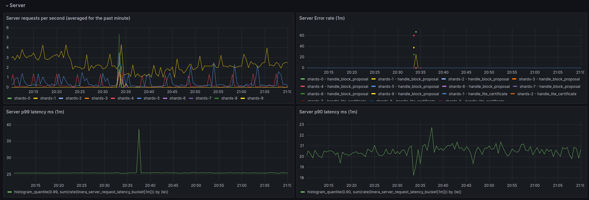

# Monitoring and Logging

This section covers how to monitor the behaviour and performance of your
validator once deployed.

## Monitoring

The validator deployment includes a complete monitoring stack:

- **[Prometheus](https://prometheus.io/)**: Metrics collection (port 9090)
- **[Grafana](https://grafana.com/)**: Visualization dashboards (port 3000)
- **Watchtower**: Automatic container updates (checks every 30 seconds)

### Accessing Grafana

1. Open your browser to `http://your-server-ip:3000`
2. Default credentials:
   - Username: `admin`
   - Password: `admin` (you'll be prompted to change it)
3. Navigate to the "General" dashboard for validator metrics

The dashboard displays:

- Request latency percentiles
- Error rates
- Throughput metrics
- Resource utilization



### Available Services and Ports

| Service     | Port    | Purpose                                           |
| ----------- | ------- | ------------------------------------------------- |
| Caddy (web) | 80, 443 | SSL/TLS termination and reverse proxy             |
| Grafana     | 3000    | Monitoring dashboards                             |
| Prometheus  | 9090    | Metrics collection                                |
| Proxy       | 19100   | Internal validator proxy (not exposed externally) |
| ScyllaDB    | 9042    | Database (internal only)                          |

## Logging

Logging is handled by Docker Compose, capturing stdout/stderr from all services.

### Viewing Logs

```bash
# View all logs
docker compose logs

# View logs for specific service
docker compose logs web          # Caddy web server
docker compose logs proxy        # Validator proxy
docker compose logs scylla       # ScyllaDB
docker compose logs shard        # Validator shards (all replicas)

# Follow logs in real-time
docker compose logs -f

# View last 100 lines
docker compose logs --tail=100

# View logs for multiple services
docker compose logs web proxy

# View logs with timestamps
docker compose logs -t
```

### Common Log Checks

```bash
# Check SSL certificate status
docker compose logs web | grep -i "certificate"

# Check for errors
docker compose logs | grep -i error

# Check ScyllaDB initialization
docker compose logs scylla | grep -i "started"

# Monitor shard health
docker compose logs shard | grep -i "health"
```

### Log Rotation

Docker automatically rotates logs. To configure log rotation, add to your
`docker-compose.yml`:

```yaml
services:
  proxy:
    logging:
      driver: 'json-file'
      options:
        max-size: '100m'
        max-file: '10'
```
