# Overview

Linera is a decentralized protocol optimized for real-time, agentic Web3
applications that require guaranteed performance for an unlimited number of
active users.

The core idea of the [Linera protocol](https://linera.io/whitepaper) is to run
many chains of blocks, called **microchains**, in parallel in one set of
validators.

## How do microchains work?

Linera users propose blocks directly to the chains that they **own**. Chains may
also be shared with other users. Linera validators ensure that all blocks are
validated and finalized in the same way across all the chains.

```mermaid
    flowchart LR
        user(["User wallet"])
        provider(["Provider"])
        validators(["Validators"])
        subgraph "Validators"
          chain1["Personal chain"]
          chain2["Temporary chain"]
          chain3["Public chain"]
          chain4["App chain"]
        end
        user -- owns --> chain1
        user -- shares --> chain2
        validators -- own --> chain3
        provider -- owns/shares --> chain4

    %% Styling
    style Validators fill:#1A4456,stroke:#70D4D3,stroke-width:2px,stroke-dasharray:3 3,rx:10,ry:10
    style user fill:#8B7355,stroke:#EDE4D2,stroke-width:2px
    style provider fill:#A0736B,stroke:#D2E8C8,stroke-width:2px
    style chain1 fill:#3A6B7A,stroke:#A0E3E2,stroke-width:2px
    style chain2 fill:#5A8269,stroke:#D2E8C8,stroke-width:2px
    style chain3 fill:#4A5A60,stroke:#F3EEE2,stroke-width:2px
    style chain4 fill:#4A7B75,stroke:#70D4D3,stroke-width:2px

```

While validation rules and security assumptions are the same for all chains,
block production in each chain can be configured in a number of ways. In
practice, most chains fall into the following categories:

- **Personal chains** (aka. **user chains**”) are those with a single **owner**,
  i.e. a single user proposing blocks.
- **Temporary chains** are shared between a few users.
- **Public chains**, usually dedicated to a particular task in the Linera
  infrastructure, are fully managed by Linera validators.
- Chains dedicated to a particular application, called **app chains**, may use
  either their own infrastructure for block production, a permissionless
  solution using proof-of-work, or a rotating set of trusted providers.

> In order to validate all the chains reliably and at minimal cost, Linera
> validators are designed to be **elastic**, meaning that they can independently
> add or remove computational power (e.g. cloud workers) on demand whenever
> needed. In turn, this allows Linera applications to scale horizontally by
> distributing work to the microchains of their users.

## What makes Linera real-time and agent-friendly?

### Connected clients

To propose blocks and provide APIs to frontends, Linera users rely on a **Linera
client**. Clients synchronize on-chain data in real-time, without trusting third
parties, thanks to local VMs and Linera’s native support for notifications.
Clients are **sparse** in the sense that they track only the chains relevant to
a particular user.

```mermaid
flowchart LR
    subgraph user_device["User device"]
        ui["Web UI or AI agent"]
        ui <-- GraphQL --> user_local

        subgraph linera_client["Linera client"]
            user_local["user chain"]
            admin_local["admin chain"]
        end
    end

    user_local <-- sync blocks --> user_remote
    user_remote -- notify incoming messages --> user_local
    admin_local <-- sync blocks --> admin_remote

    subgraph validators_clients["Validators"]
        user_remote["user chain"]
        admin_remote["admin chain"]
    end

    %% Styling
    style user_device fill:#1A4456,stroke:#70D4D3,stroke-width:2px,stroke-dasharray:3 3,rx:10,ry:10
    style linera_client fill:#0e2630,stroke:#A0E3E2,stroke-width:1px,stroke-dasharray:2 2,rx:8,ry:8
    style validators_clients fill:#1A4456,stroke:#70D4D3,stroke-width:2px,stroke-dasharray:3 3,rx:10,ry:10

    style ui fill:#8B7355,stroke:#EDE4D2,stroke-width:2px
    style user_local fill:#3A6B7A,stroke:#A0E3E2,stroke-width:2px
    style admin_local fill:#3A6B7A,stroke:#A0E3E2,stroke-width:2px
    style user_remote fill:#4A5A60,stroke:#F3EEE2,stroke-width:2px
    style admin_remote fill:#4A5A60,stroke:#F3EEE2,stroke-width:2px

```

User interfaces interact with Linera applications by querying and sending
high-level commands to local GraphQL services running securely inside the Linera
client.

Similarly,
[discussions](../developers/core_concepts/node_service.html#connecting-ai-agents-to-linera-applications-in-mcp)
between AI agents and Linera applications stay local, hence private and free of
charge. This also protects agents against compromised external RPC services.

> Linera is the first Layer-1 to allow **trustless real-time synchronization**
> of user data on their devices, democratizing low-latency data access and
> bringing professional-grade security to frontends, customized oracle networks,
> and AI-trading agents.

### Geographic sharding

In the future, Linera validators will be incentivized to operate machines and
maintain a presence in a number of key regions. Most microchains will be pinned
explicitly to a specific region, giving users of this region the lowest latency
possible in their on-chain interactions. Linera validators will be incentivized
to connect their regional data-centers using a low-latency network.

```mermaid
flowchart LR
    subgraph region_1["Region 1"]
        user1(["User 1"])
        chain1["chain 1"]
        chain2["chain 2"]
    end
    subgraph region_2["Region 2"]
        chain3["chain 3"]
        chain4["chain 4"]
    end
    user1 --> chain1
	  chain1 <--> chain2
	  chain2 <---> chain3
	  chain2 <---> chain3
	  chain3 <--> chain4

    %% Styling
    style region_1 fill:#1A4456,stroke:#70D4D3,stroke-width:2px,stroke-dasharray:3 3,rx:10,ry:10
    style region_2 fill:#1A4456,stroke:#70D4D3,stroke-width:2px,stroke-dasharray:3 3,rx:10,ry:10
    style user1 fill:#8B7355,stroke:#EDE4D2,stroke-width:2px
    style chain1 fill:#3A6B7A,stroke:#A0E3E2,stroke-width:2px
    style chain2 fill:#3A6B7A,stroke:#A0E3E2,stroke-width:2px
    style chain3 fill:#4A5A60,stroke:#F3EEE2,stroke-width:2px
    style chain4 fill:#4A5A60,stroke:#F3EEE2,stroke-width:2px

```

Importantly, geographic affinity in Linera is not conditioned to the time of the
day allowing applications to deliver similar performance at night and during
working hours. Yet, Linera validators have the flexibility to downsize and
upsize their pool of machines at will to save costs.

## How do Linera microchains compare to traditional multi-chain protocols?

Linera is the first blockchain designed to run a virtually unlimited number of
chains in parallel, including one dedicated **user chain** per user wallet.

In traditional multi-chain protocols, each chain usually runs a full blockchain
protocol in a separate set of validators. Creating a new chain or exchanging
messages between chains is expensive. As a result, the total number of chains is
generally limited.

In contrast, **Linera is designed to run as many microchains as needed**:

- Users only create blocks in their chain when needed;

- Creating a microchain does not require onboarding validators;

- All chains have the same level of security;

- Microchains communicate efficiently using the internal networks of validators;

- Validators are internally sharded (like a regular web service) and may adjust
  their capacity elastically by adding or removing internal workers.

- Users may run heavy transactions in their microchain without affecting other
  users.

## Main protocol features

**Infrastructure**

- Finality time under 0.5 seconds for most blocks, including a certificate of
  execution.

- New microchains created in one transaction from an existing chain.

- No theoretical limit in the number of microchains, hence the number of
  transactions per second (TPS).

- Bridge-friendly block headers compatible with EVM signatures

**On-chain applications**

- Rich programming model allowing applications to distribute computation across
  chains using asynchronous messages, shared immutable data, and event streams.

- Full synchronous composability inside each microchain.

- Support for heavy (multi-second) transactions and direct oracle queries to
  external web services and data storage layers.

**Web client and wallet infrastructure**

- Real-time push-notifications from validators to web clients.

- Block synchronization and VM execution for selected microchains, allowing
  instant pre-confirmation of user transactions.

- Trustless reactive programming using familiar Web2 frameworks.

- On-chain applications programmed in Rust to run on Wasm, or Solidity on
  EVM(\*).

_Features marked with (\*) are under active development on the main branch._
