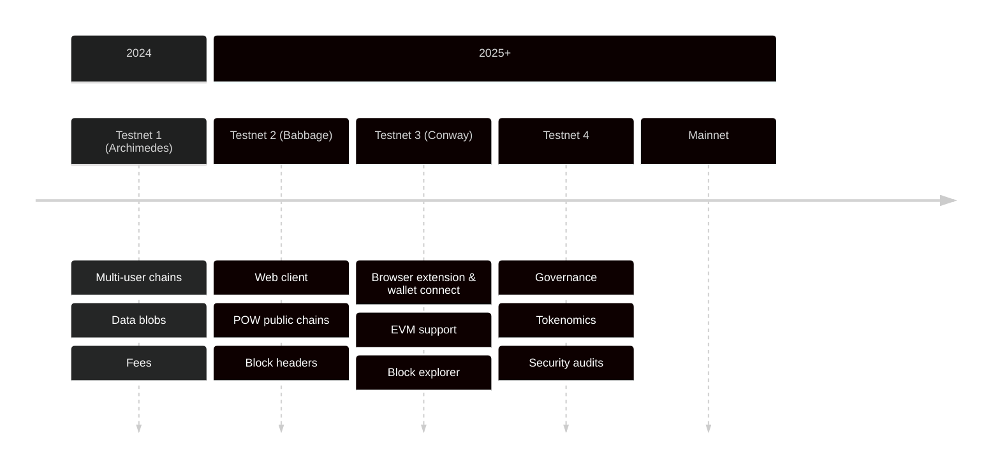

# Roadmap

This section outlines our current technical roadmap. Please note that this
roadmap is provided for informational purposes only and is subject to change at
any time.

## Testnet #1 (released Nov 2024)

Codename: Archimedes

**SDK**

- Released Rust SDK v0.13+

- First Web demos running a Linera client in the browser

- Blob storage for user data

**Core protocol**

- Blob storage for application bytecode and user data

- Multi-user chains (e.g. used in on-chain game demo)

- Initial support for fees

**Infrastructure**

- Fixed number of workers per validator

- Onboarding of 20+ external validators

## Testnet #2 (released Apr 2025)

Codename: Babbage

**SDK**

- Official Web client framework

- Support for native oracles: http queries and non-deterministic computations

- Support for POW public chains

- Simplified user and application addresses

**Core protocol**

- More scalable reconfigurations

- No more "request-application" operations

- Bridge-friendly block headers compatible with EVM signatures

**Infrastructure**

- Better hotfix release process

- Support for resizing workers offline

## Testnet #3 (released Sep 2025)

Codename: Conway

**SDK**

- Wallet connect (signing demo with external wallet)

- Event streams (deprecating pub/sub channels)

- Experimental support for EVM

- Compatibility with EVM addresses

**Core protocol**

- More scalable client with partial chain execution and optimized block
  synchronization

- Execution cache for faster server-side and client-side block execution

- Simplify chain creation and support externally created microchains

**Infrastructure**

- High-TPS configuration

- Software service to support block indexing

## Testnet #4

**SDK**

- Stable support for EVM

- Transaction scripts

- Application upgradability

**Core protocol**

- Protocol upgradability, including block format, virtual machines, and system
  APIs

- Governance chain

- Final tokenomics and fees

- Storage durability

**Infrastructure**

- Network performance measurements and validator incentives

- Security audits

## Mainnet and beyond

**SDK**

- Account abstraction and fee masters

- Linera light clients for other contract languages (e.g. Solidity, Sui Move)

**Core Protocol**

- Permissionless auditing protocol

- Performance improvements

**Infrastructure**

- Block indexing and block explorer

- Walrus archives

- Support for dynamic shard assignment and elasticity

- Geographic sharding

- Support for more cloud vendors

- Native bridges
