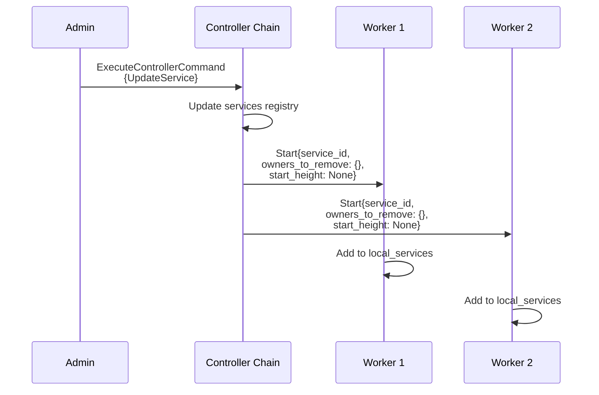
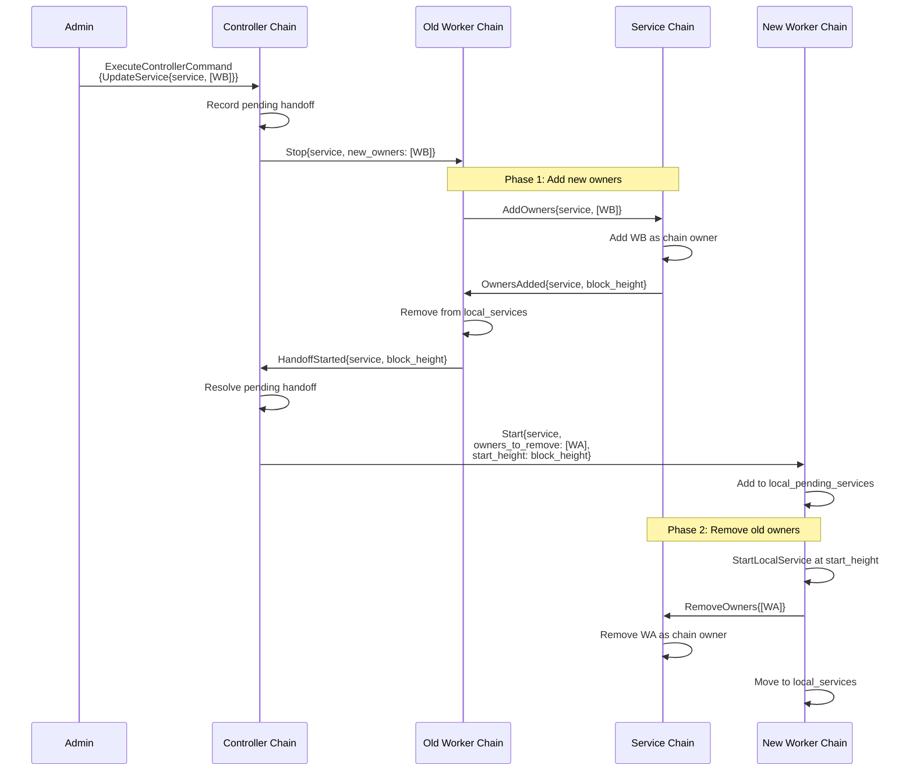
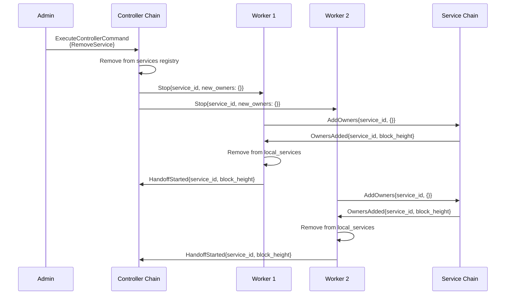

# Controller

The Controller is a Linera application that manages the orchestration of distributed
services across multiple worker nodes. It provides a centralized registry for workers and
services, enabling dynamic assignment and coordination.

## Concepts

### Workers

A **Worker** is a node that can run services. Each worker:
- Runs on its own chain
- Registers itself with the controller, declaring its capabilities
- Receives commands from the controller to start/stop services
- Can follow additional chains as needed

### Services

A **Service** is a task or application component that runs on one or more workers. Services are identified by a `ServiceId` (a blob hash of their description). A service can be assigned to multiple workers for redundancy or load distribution.

### Controller Chain

The **Controller Chain** is the chain where the controller application was originally deployed. It serves as the central authority that:
- Maintains the registry of all workers
- Tracks which services run on which workers
- Processes admin commands to update service assignments

### Admin

**Admins** are authorized account owners who can execute controller commands to manage services. If no admin list is set, operations are permissive but remote commands are rejected for safety.

## Architecture

Workers register with the controller and receive Start/Stop messages for services.

## Message Flow

### Worker Registration

When a worker wants to join the network:

### Service Assignment

When an admin assigns a service to workers:

### Service Handoff (Reassignment)

When a service is moved from one worker to another, all three chain types
participate in a two-phase handoff protocol. The new worker's owners are added
to the service chain first, then the old worker's owners are removed, ensuring
there is no gap in ownership.

### Service Removal

When a service is removed, Stop messages are sent to all workers. Each worker
initiates ownership cleanup through the service chain before removing the
service locally, following the same handoff protocol but with empty new owners.

## Operations

### Worker Commands

| Command | Description |
|---------|-------------|
| `RegisterWorker { capabilities }` | Register a worker with its capabilities |
| `DeregisterWorker` | Remove the worker from the network |

### Controller Commands (Admin Only)

| Command | Description |
|---------|-------------|
| `SetAdmins { admins }` | Set the list of authorized admin accounts |
| `RemoveWorker { worker_id }` | Force-remove a worker and clean up its assignments |
| `UpdateService { service_id, workers }` | Assign a service to specific workers |
| `RemoveService { service_id }` | Remove a service from all workers |
| `UpdateAllServices { services }` | Bulk update all service assignments |

## State

### Controller Chain State

- `admins`: Set of authorized admin accounts
- `workers`: Map of ChainId to Worker (all registered workers)
- `services`: Map of ServiceId to Set of ChainIds (service assignments)

### Worker Chain State

- `local_worker`: This worker's registration info
- `local_services`: Set of services running on this worker
- `local_chains`: Additional chains this worker is following

## Messages

Messages are sent between chains to coordinate state:

| Message | Direction | Purpose |
|---------|-----------|---------|
| `ExecuteWorkerCommand` | Worker -> Controller | Register/deregister worker |
| `ExecuteControllerCommand` | Any -> Controller | Admin commands |
| `Reset` | Controller -> Worker | Clear worker state |
| `Start { service_id, owners_to_remove, start_height }` | Controller -> Worker | Start a service, optionally with handoff info |
| `Stop { service_id, new_owners }` | Controller -> Worker | Stop a service, initiating ownership handoff via the service chain |
| `FollowChain { chain_id }` | Controller -> Worker | Follow a chain |
| `ForgetChain { chain_id }` | Controller -> Worker | Stop following a chain |
